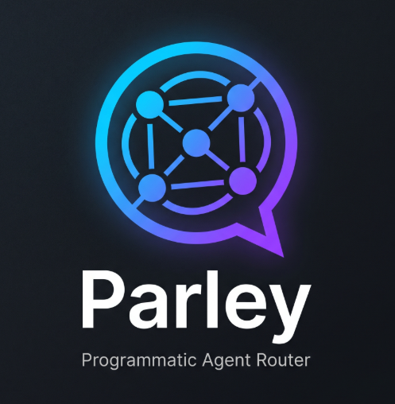

<div align="center">



# Parley

**Your coding agents are smarter together.**

A **CLI** *and* an **MCP server** that convene a panel of the agents you already run — Claude, Codex, Gemini, and more — and fuse their answers into one.

[](LICENSE)
&nbsp;
&nbsp;
&nbsp;

[**Install**](#install) · [**Fuse**](#fuse--a-panel-of-agents-one-answer) · [**CLI ↔ MCP**](#two-surfaces-one-tool) · [**Playbook**](docs/fusion-playbook.md) · [**Why**](#why)

</div>

---

A single agent is a single model's judgment — one set of blind spots. Parley sends the same problem to a **panel** of agent CLIs, then fuses their replies: where they agree you get high-confidence consensus, where they disagree you get a flag worth your attention, and what none caught the panel surfaces. This is the multi-model deliberation behind **[Sakana's AB-MCTS](https://sakana.ai/ab-mcts/)** and **[OpenRouter's Fusion](https://openrouter.ai/blog/announcements/fusion-beats-frontier/)** — both report combined models beating any single one — but running over the CLIs already on your machine, with *their* auth and *your* context. **No API keys. No new vendor. Your code never leaves.**

## Two surfaces, one tool

Parley is **first-class both ways** — a CLI you drive, and an MCP server your agent drives. Same engine, same capabilities, whichever side you call it from:

| Capability | **CLI** — *you* run it | **MCP** — *your agent* calls it |
| --- | --- | --- |
| **Fuse** a panel into one answer | `par fuse "design a rate limiter"` | `fuse` tool |
| **Auto-route** to the best agent | `par route "…"` · `par -h auto -p "…"` | — |
| **Solve** with auto-escalation | `par solve "…"` | *(compose via `ask_agent` + `fuse`)* |
| **Ask** another agent, with context | `par ask -h g -p "…" --context-from cl` | `ask_agent` tool |
| **Resume** any agent's session here | `par resume` | `list_sessions` · `get_last_session` · `resume_command` |
| **Converse** — two agents, multi-turn | `par converse --a cl --b g -p "…"` | *(compose via `ask_agent`)* |
| **Route** a prompt to any agent | `par -p "…" -h <agent>` | — |
| **Convert** one config to every agent | `par convert` | — |

```sh
# Drive it yourself…
par fuse "design a rate limiter for this service"    # panel + judge → one fused answer

# …or wire it into your agent once, and let Claude convene the panel mid-task:
par mcp connect -h cl                                # registers the MCP server into Claude
#   then just say: "fuse this across codex and gemini"  → Claude calls the `fuse` tool itself
```

Parley is a small, dependency-free Rust CLI (binary: `par`). It never calls a model API itself — it drives the agent CLIs you already have, so your auth, models, and permissions stay with them. The MCP server exposes the very same operations as tools, so nothing is locked to one surface.

> **Prefer a window to a terminal?** [**Parley Desktop**](desktop/README.md) is a small Tauri chat app over the same engine — one chat, switch between Auto / Fuse / Solve / any single agent per message, with live-streamed panels. It's a thin shell that drives `par`, so it inherits each agent's own auth, subscription, and caching.

## Why

**A single agent is a single point of view.** Every coding agent ships one model's training, one model's failure modes, one model's blind spots. On the calls that matter — an architecture decision, a security review, a tricky migration — there's no second opinion, no disagreement to flag risk, no way to combine the model that reasons best with the model that writes the best code.

Research labs already proved the fix. Sakana's AB-MCTS lets frontier models cooperate at inference time and reports problems *no single model could solve* becoming solvable. OpenRouter's Fusion runs a panel plus a judge and reports a fused pair beating every individual model. The catch with both: API-side, single-vendor, and your code leaves your machine.

**Parley does it locally — and fixes the other half of the problem, that the agents are silos.** Each CLI has its own headless interface (`claude -p`, `codex exec`, `gemini --prompt`, `goose run -t`, `opencode run`, `aider --message`), its own config format, and its own on-disk session store — none can see each other. So:

- **Agents can't combine.** Two models with different strengths have no way to review each other's work, debate, or vote on an answer.
- **Scripts are brittle.** Switching agents means rewriting commands, model flags, provider syntax, and env vars.
- **Config is duplicated.** The same instructions, commands, and MCP servers get hand-maintained once per agent.
- **Work gets stranded.** A conversation lives inside whichever agent you started in; you can't pick it up elsewhere.

**Parley is the interoperability layer that removes all four — and turns it into collective intelligence:**

- **Fuse** — `par fuse "..."` sends your prompt to a panel of agents in parallel, then a judge (Claude by default) synthesizes one answer from their consensus, contradictions, and blind spots. Same thing is an **MCP tool**, so an agent can convene its own panel mid-task — escalation when a question is worth more than one model.
- **One interface** — route any prompt to any agent by changing a single flag (`par -p`, `-h <agent>`). The adapter owns the translation.
- **One config** — author your `.claude/` pack once, `par convert` generates each agent's native config from it.
- **Portable sessions** — `par resume` lists and resumes any agent's past sessions for this folder, regardless of which agent created them.
- **Agents that collaborate** — `par ask` lets one agent query another (seeded with a shared session's context), and `par converse` puts two agents in a multi-turn conversation. Expose it over MCP with `par mcp` so an agent can do this itself — *"ask Gemini to review this, with my Claude context."*

The result: your automation describes *intent*, not which agent is wired up today — and your agents stop being islands and start being a team.

> **New to fusion?** The [Fusion Playbook](docs/fusion-playbook.md) is the how-to for ~10× better results: when to fuse, how to pick a diverse panel, and the debate / wider-deeper / second-opinion patterns.

---

## Install

One command:

```sh
curl --proto '=https' --tlsv1.2 -sSf https://raw.githubusercontent.com/KerryRitter/parley/main/install.sh | sh
```

This installs `par` into `~/.local/bin` (plus an `agent-router` alias). Make sure that directory is on your `PATH`:

```sh
export PATH="$HOME/.local/bin:$PATH"
par --version          # verify
```

> `par` routes to agent CLIs — it does not install them for you automatically. Install the agents you want with [`par install`](#install-agent-clis), or bring your own.

### Other install methods

**From source** (needs [Rust](https://sh.rustup.rs)):

```sh
git clone https://github.com/KerryRitter/parley.git
cd parley
scripts/setup.sh --install        # validates, then `cargo install --path . --force`
```

This creates `~/.local/bin/par` and `~/.local/bin/agent-router -> par`. Ensure both `~/.cargo/bin` and `~/.local/bin` are on your `PATH`.

**Direct from GitHub:**

```sh
cargo install --git https://github.com/KerryRitter/parley.git --branch main --force
```

**Install-script options** (append after `sh -s --`):

```sh
... | sh -s -- --install-dir /usr/local/bin   # custom location
... | sh -s -- --from-source                  # force a source build
... | sh -s -- --from-source --git-protocol ssh
... | sh -s -- --no-agent-router              # skip the agent-router alias
```

The script installs a prebuilt release binary for your platform when available, and falls back to a source build otherwise. (Release-binary and Homebrew distribution are planned; see [Release Plan](#release-plan).)

---

## What par can do

| Command | Capability |
| --- | --- |
| [`par -p "..."`](#run-a-prompt) | Route a prompt to any agent, with one shared flag set |
| [`par fuse "..."`](#fuse--a-panel-of-agents-one-answer) | Run a panel of agents in parallel; a judge fuses one answer (also an MCP tool) |
| [`par route "..."`](#route--auto-pick-the-best-agent-for-a-prompt) | Pick the best agent for a prompt — and explain why (`-h auto` routes then runs) |
| [`par solve "..."`](#solve--auto-escalate-a-stuck-agent-to-a-panel) | Route to one agent, then auto-escalate to a `fuse` panel if it gets stuck |
| [`par stats`](#stats--learn-routing-from-your-own-runs) | Local per-(task, agent) scoreboard that learns better routing over time |
| [`par commands install`](#slash-commands--statusline) | Generate `/fuse` · `/solve` · `/route` slash commands into your agents |
| [`par default <agent>`](#set-a-default-agent) | Pick the default agent (and options) for this machine |
| [`par install <agent>`](#install-agent-clis) | Install a downstream agent CLI |
| [`par shims install`](#shims) | Create `claudey` / `codexy` one-shot shortcuts |
| [`par convert`](#convert--share-one-config-across-agents) | Port your `.claude/` config to every other agent |
| [`par resume`](#resume--continue-a-past-session-from-any-agent) | Browse & resume past sessions across all agents, scoped to the folder |
| [`par ask`](#ask--one-agent-talks-to-another) | Ask another agent headless, optionally seeded with a prior session's context |
| [`par converse`](#converse--two-agents-multi-turn) | Put two agents in a multi-turn conversation, watching them work it out |
| [`par mcp`](#mcp--fuse-ask-and-resume-from-inside-your-agent) | Run an MCP server: agents can **fuse** a panel, ask each other, and resume sessions |

---

## Run a prompt

```sh
par                                    # launch the default agent interactively
par -p "summarize this repository"     # one-shot prompt
par -h co -m gpt-5.4 -p "add tests"    # choose an agent + model
git diff | par -p "review this patch"  # pipe context in
par -p "review src" --dry-run          # print the routed command instead of running it
```

**Choosing the agent** — `-h` / `--harness` takes a full name or a short code:

| Code | Agent | Code | Agent | Code | Agent |
| --- | --- | --- | --- | --- | --- |
| `cl` | claude | `g` | gemini | `q` | qwen |
| `co` | codex | `go` | goose | `a` / `ai` | aider |
| `cu` | cursor | `oc` | opencode | `aq` | amazon-q |
| `cp` | copilot | `k` | kimi | `ag` | antigravity |

```sh
par -h cl "review this"
par -h co -m gpt-5.4 "fix tests"
par -h k -p "drain the queue"
```

> Bare `-h` (no value) prints help; `-h <name>` selects an agent.

### Flags

| Flag | Purpose |
| --- | --- |
| `-p`, `--prompt`, `--print` | Prompt text (`--print` is accepted for Claude compatibility). |
| `-h`, `--harness <name>` | Target agent. Defaults to `claude`. Accepts short codes. |
| `--provider <name>` | Provider namespace, when the agent uses provider-qualified models or env config. |
| `-m`, `--model <name>` | Model name. |
| `--agent <name>` | Agent/persona/profile, where supported. |
| `--output-format <fmt>` | Output mode (e.g. `json`), where supported. |
| `--input-format <fmt>` | Claude-compatible input format. |
| `--permission-mode <mode>` | Permission/sandbox mode, where supported. |
| `--max-turns <n>` | Max agent turns, where supported. |
| `--cwd <path>` | Working directory for the child process. |
| `--yolo` / `--no-yolo` | Add / skip the agent's permission-bypass flag. **On by default.** |
| `--dry-run` | Print the routed invocation as JSON; run nothing. |
| `--version`, `-v` | Print version. |
| `--help` | Print help. |
| `--` | Pass everything after it straight to the agent CLI. |

**Pass agent-specific flags** after `--`:

```sh
par -h cl -p "review this" -- --verbose
par -h aider -p "fix lint" -- --yes --no-auto-commits
```

**How prompt input is resolved:**

- No prompt and no stdin → launch the agent's interactive entrypoint.
- stdin piped **and** `-p` given → stdin is placed before the prompt, blank line between.
- stdin piped, no `-p` → stdin becomes the prompt.

### Yolo (permission bypass) is on by default

Every run adds the agent's permission-bypass flag (e.g. `--dangerously-skip-permissions` for Claude) so automation runs hands-off. Opt out per run with `--no-yolo`, or persistently with `PARLEY_YOLO=false`. Agents with no known bypass flag (e.g. Amazon Q) simply run without one. **Opt out when running untrusted prompts or in sensitive directories.**

### Set a default agent

So you don't repeat `-h` every time:

```sh
par default codex            # set default agent
par default claude --yolo    # set agent + persist yolo
par default --no-yolo        # keep agent, disable yolo
par default                  # show current defaults
par default --path           # print the config file path
par current                  # alias for showing defaults
par list                     # list supported agent names
```

The default lives in `~/.config/par/default` (or `$XDG_CONFIG_HOME/par/default`; override with `PAR_DEFAULT_FILE`).

### Environment defaults

```sh
export PARLEY_HARNESS=codex
export PARLEY_PROVIDER=openai
export PARLEY_MODEL=gpt-5.4
export PARLEY_YOLO=true
# legacy AGENT_ROUTER_* names are still honored as a fallback
```

### Shims

Generate `*y` one-shot shortcuts for yolo-capable agents:

```sh
par shims install            # writes claudey, codexy, ... to ~/.local/bin
claudey -p "work in this sandbox"
codexy "work in this sandbox"
```

Override the location with `par shims install --dir <dir>` or `PAR_SHIM_DIR`. `par shims list` prints the generated names and commands.

---

## Fuse — a panel of agents, one answer

`par fuse` is the collective-intelligence command. It sends your prompt to a **panel** of agents *in parallel*, then hands every reply to a **judge** agent — Claude by default — that synthesizes a single answer: where the panel agreed (high-confidence), where it disagreed and who's right, and what it missed. Same idea as OpenRouter's Fusion and Sakana's AB-MCTS, over the CLIs you already run. It's available both as this command **and** as an [MCP tool](#mcp--fuse-ask-and-resume-from-inside-your-agent) so an agent can convene its own panel mid-task.

```sh
par fuse -p "design a rate limiter for a multi-tenant API"        # default panel: claude, codex, gemini
par fuse "is this migration safe to run on a live DB?" --panel cl,co,k
par fuse "..." --judge co --judge-model gpt-5.4                    # choose the judge and its model
par fuse "..." --context-from cl                                  # seed every panelist with your latest claude session here
par fuse "..." --panel cl,co,g --dry-run                          # print every routed command (panel + judge), run nothing
```

| Flag | Purpose |
| --- | --- |
| `--panel <codes>` | Comma-separated panel agents (short codes allowed). Defaults to `claude,codex,gemini`. Needs ≥2; duplicates are allowed (self-pairing is a valid technique). |
| `--judge <agent>` | Agent that synthesizes the panel. Defaults to **claude**. |
| `--judge-model <m>` | Model for the judge. |
| `--context-from <h[:s]>` | Prepend a prior session's transcript to every panelist, so the panel deliberates with your context (sources: `claude`, `codex`, `opencode`). |
| `--max-context`, `--cwd`, `--no-yolo`, `--dry-run` | As in [`par ask`](#ask--one-agent-talks-to-another). |

Panelists run **concurrently**, so wall-clock ≈ the slowest agent + the judge, and cost ≈ N+1 agent runs. A panelist whose CLI isn't installed is skipped with a note; fusion needs at least two to succeed. Alias: `par panel`.

**Fuse selectively** — it's escalation, not autopilot. Reach for it on the calls where being wrong is expensive (design, security, migrations), and use a *diverse* panel (different vendors, not three of the same model). The [Fusion Playbook](docs/fusion-playbook.md) covers when to fuse, how to pick the panel, and the debate / wider-deeper patterns that stack on top.

Pass `--panel auto` to let the router pick a diverse panel for the prompt:

```sh
par fuse --panel auto -p "is this migration safe to run on a live DB?"
```

---

## Route — auto-pick the best agent for a prompt

You shouldn't have to remember which agent is best at what. `par route` reads a prompt, classifies the task (debug, code, refactor, test, review, architecture, explain), and scores every agent against a `task × agent` table — then tells you who should answer, and why.

```sh
par route "fix the failing test that crashes on startup"   # → codex (task: debug)
par route "design a scalable multi-tenant rate limiter"    # → gemini / claude (task: architecture)
par route "..." --bias 1.0                                 # 0 = cheapest/fastest, 1 = strongest (default 0.7)
par route "..." --json                                     # decision + every candidate's score
```

```text
task class : debug
→ route to : codex
  reason   : prompt looks like 'debug'; codex ranks highest (quality 0.92, blend 0.81 at bias 0.70)
  panel    : codex, cursor, gemini

  AGENT        FAMILY      QUALITY    BLEND  INSTALLED
  codex        openai         0.92     0.81  yes
  cursor       cursor         0.86     0.81  yes
  claude       anthropic      0.90     0.80  yes
  ...
```

Then **route and run** in one step:

```sh
par -h auto -p "refactor this module and simplify it"      # picks the agent, runs it
par default auto                                           # make auto-routing the default
```

**How it works.** This is the [workweave/router](https://github.com/workweave/router) routing brain, ported to a zero-dependency CLI: their two-phase design — heavy offline training → a tiny frozen table → runtime is pure arithmetic (score every candidate, argmax) — transfers cleanly; only their on-box neural embedder doesn't (it needs ONNX + a 100 MB model). So `par` swaps the embedder for a dependency-free keyword classifier and blends each agent's quality against a speed/cost axis with a single `quality_bias` dial — exactly the router's `quality·α + (1−cost)·(1−α)` shape. The quality numbers are a hand-seeded starting point (the same cold-start fidelity the router gets from public benchmarks); [`par stats`](#stats--learn-routing-from-your-own-runs) surfaces your real outcomes so the table can be tuned over time.

The picker only considers agents whose CLI is actually installed, and never silently picks wrong: with no installable candidate it falls back to your default agent.

### Meta-harnesses — agents made of agents

`auto`, `fuse`, and `solve` are **meta-harnesses**: harnesses that call back into `par` instead of driving one agent CLI. Because every surface (panelists, conversation participants, `ask`, the run path) turns a harness into a command and spawns it, the meta-harnesses compose *everywhere a harness is accepted* — for free:

```sh
par -h auto -p "..."                  # route to the best agent
par fuse --panel auto,auto,auto       # three independently-routed panelists
par converse --a fuse --b claude      # a whole panel debates a single agent
par fuse --panel claude,solve         # a panelist that self-escalates if it stalls
par ask -h fuse -p "..."              # ask "the panel" as if it were one agent
par fuse --judge solve "..."          # the judge itself routes + escalates
```

`auto` resolves the router and delegates to the chosen real agent in-process (no extra spawn); `fuse`/`solve` recurse into `par <sub>`. A depth counter in `PARLEY_META_DEPTH` (inherited across the recursive spawns) caps nesting so `--panel fuse,fuse,…` can't fork-bomb. Yes, it's turtles — but bounded turtles.

---

## Solve — auto-escalate a stuck agent to a panel

`par solve` is fusion-as-escalation, automatic. It routes your prompt to a single agent (cheap, fast), watches the result, and **only convenes a panel if that agent gets stuck** — a degenerate (near-empty) reply, an error/failure marker in the output (a traceback, a red test), a non-zero exit, a watchdog timeout, or — for code-shaped tasks — leaving the working tree untouched. On any of those, it escalates to a `fuse` panel seeded with the failed attempt, so the panel knows what already didn't work.

```sh
par solve "add a --json flag to the export command"        # one agent; panel only if it stalls
par solve "..." -h co                                      # force the first agent
par solve "..." --panel cl,g --judge co                    # force the escalation panel + judge
par solve "..." --shadow                                   # detect-only: report what WOULD escalate
```

This is the [router's loop-escalation idea](https://github.com/workweave/router), made stronger: the router can only swap to a bigger *model*; `par` swaps *strategy* — a single agent that fails escalates to a whole panel. The detection heuristics (degenerate reply, error-marker scan, the "no file change = no progress" oracle from `git`) are the portable distillation of the router's loop- and spiral-detectors. `--shadow` mirrors its shadow-mode-first discipline: measure precision on your real runs before letting it act.

`par converse` gets the same loop sense — if two agents collapse onto the same answer, the conversation stops early instead of burning the turn budget.

---

## Stats — learn routing from your own runs

Every `par` run appends one line to a local JSONL log (`~/.config/par/telemetry.jsonl`) — which agent ran what kind of task, and how it went (success, latency, whether it stalled). `par stats` turns that into a scoreboard, the substrate for tuning the routing table to *your* agents and *your* work.

```sh
par stats                 # per-(task, agent) success-rate + latency  (alias: par gain)
par stats --json          # machine-readable
par rate + great answer   # thumbs-up the last run;  par rate - too slow  for thumbs-down
```

```text
Parley stats — 142 runs, 88% ok, 12 👍 / 3 👎
  TASK           AGENT       RUNS    OK%       AVG
  code           codex         41    95%     8.4s
  architecture   claude        22    91%    14.1s
  debug          gemini        18    72%     6.2s
```

This is the local, server-free version of the router's telemetry + feedback loop. **Privacy:** the prompt text is never stored — only its length and a non-reversible fingerprint. Opt into raw-prompt capture with `PARLEY_TELEMETRY_PROMPTS=1`, or disable telemetry entirely with `PARLEY_TELEMETRY=off`. Nothing ever leaves your machine. `par fuse`'s judge already picks a winner per prompt — a free quality label the scoreboard can accumulate.

---

## Slash commands & statusline

Generate Parley slash commands into the agents you drive, so `/fuse`, `/solve`, and `/route` are one keystroke away from inside Claude Code or Codex:

```sh
par commands install -h cl       # writes /fuse, /solve, /route into ./.claude/commands
par commands install -h co       # ...or into ./.codex/prompts
par commands install -h cl --dir path/to/project --dry-run
```

Each file carries a `par-generated` marker (the same contract as `par convert`), so re-running replaces only its own output, never a hand-authored command. Files that would overwrite a symlink are refused — `par` writes safely into project directories.

A status-line badge for Claude Code, with no daemon or sidecar:

```jsonc
// ~/.claude/settings.json
"statusLine": { "type": "command", "command": "par statusline" }
```

---

## Install agent CLIs

`par` can install the downstream agents it routes to:

```sh
par install list             # show installer coverage
par install claude           # install one agent
par install all              # install every supported agent
par install --dry-run all    # print the exact upstream commands, run nothing
```

The registry is transparent — `--dry-run` prints the real upstream install command. Agents without a stable one-liner (e.g. Amazon Q) print the official install page and a verify command instead of guessing.

| Agent | Installer |
| --- | --- |
| `claude` | `curl -fsSL https://claude.ai/install.sh \| bash` |
| `codex` | `npm install -g @openai/codex` |
| `cursor` | `curl https://cursor.com/install -fsS \| bash` |
| `gemini` | `npm install -g @google/gemini-cli` |
| `goose` | `curl -fsSL https://github.com/block/goose/releases/download/stable/download_cli.sh \| bash` |
| `opencode` | `curl -fsSL https://opencode.ai/install \| bash` |
| `qwen` | `curl -fsSL https://qwen-code-assets.oss-cn-hangzhou.aliyuncs.com/installation/install-qwen.sh \| bash` |
| `aider` | `curl -LsSf https://aider.chat/install.sh \| sh` |
| `amazon-q` | Manual official installer page; verify with `q --version` |
| `copilot` | `curl -fsSL https://gh.io/copilot-install \| bash` |
| `kimi` | `curl -LsSf https://code.kimi.com/install.sh \| bash` |
| `antigravity` | `curl -fsSL https://antigravity.google/cli/install.sh \| bash` |

> `par` does not manage agent versions; each downstream CLI owns its own upgrade flow.

---

## Convert — share one config across agents

`par convert` ports a Claude command/skill pack to other agents. Your `.claude/` directory (commands, skills, `agents/`, references), `CLAUDE.md`, and `.mcp.json` stay the **single source of truth**; convert generates each agent's native config from them.

```sh
par convert                       # claude -> all targets
par convert --to kimi             # claude -> one target
par convert --from claude --to codex
par convert --dry-run             # show what would be written
par convert --cwd path/to/project
```

**Source:** `claude`. **Targets:** `gemini`, `codex`, `antigravity`, `opencode`, `cursor`, `kimi`.

What it does:

- **Parses frontmatter** — real descriptions, per-command `model`, argument placeholders; strips the block from bodies.
- **Reads** commands, skills, personas (`.claude/agents/`), references, and `.mcp.json`.
- **Emits native artifacts per target** — e.g. `.kimi/skills/<name>/SKILL.md` + `.kimi/mcp.json`, `.codex/config.toml` + `.agents/skills/`, `.gemini/commands/*.toml` + `GEMINI.md`, `.cursor/rules/`, `.opencode/config.json`, plus `AGENTS.md`. MCP servers in `.mcp.json` are translated into each agent's format.
- **Resolves cross-references** — every `/command`, `**skill** skill`, persona path, and reference path is checked against the pack. The run prints a resolution report and **exits non-zero if any reference dead-ends**, so a typo fails the convert instead of shipping a broken pack.

Generated skills carry a `par-convert:generated` marker, so re-running replaces only its own output and never a hand-authored file. Commit `.claude/`; git-ignore the generated output. A typical `npm run sync:instructions` is just `par convert --from claude --to all`.

---

## Resume — continue a past session from any agent

`par resume` browses and resumes sessions from **any** agent, scoped to the current directory — the same scoping every agent's own `--resume` uses. It reads the transcripts each agent already writes to disk; there are no extra files to maintain.

```sh
par resume                      # list this folder's sessions (any agent), pick one
par resume -h cl                # resume a claude session here (picker if several)
par resume -h co --latest       # resume the newest codex session, no prompt
par resume --list               # print the listing, resume nothing
par resume --list --json        # machine-readable listing
par resume -h cl <id> --print   # print the resume command for a session id
par resume --cwd path/to/proj   # scope to another directory
```

A selector is either a list index (`par resume 2`) or a raw session id (`par resume -h cl <id>`). Add `--yolo` to append the agent's permission-bypass flag (off by default here, since resume drops into an interactive session).

**Two tiers of support:**

- **Native listing** — `claude`, `codex`, `opencode`. Read straight from disk (`~/.claude/projects/<slug>/`, `~/.codex/sessions/`, `~/.local/share/opencode/storage/session/`), matched on exact cwd, with title and recency. These show up in the cross-agent listing.
- **Delegate resume** — `cursor`, `gemini`. Their stores are hash-scoped in a way `par` doesn't reproduce, but the binaries self-scope to the cwd. Listing is skipped (marked `~`); resume runs the agent's own cwd-scoped resume (`cursor-agent resume`, `gemini --resume latest`). `par resume -h cu` / `par resume -h g` work directly.

---

## Ask — one agent talks to another

`par ask` runs another agent **headless** and returns its reply as text. Because `par` already routes a prompt to any agent, "Claude asks Gemini" is just routing the prompt to Gemini and capturing its output. With `--context-from`, `par` first reads a prior session's transcript and prepends it — so the answer is informed by that history. This is the cross-agent **context bridge**.

```sh
par ask -h g -p "critique this approach in 3 bullets"        # ask gemini, print its reply
par ask -h g -p "what did we decide?" --context-from cl      # seed with your latest claude session here
par ask -h cl -p "continue this" --context-from co:<id>      # use a specific source session id
par ask -h g -p "..." --max-context 8000                     # cap injected context (default 12000 chars)
par ask -h g -p "..." --dry-run                              # show the routed command + final prompt, run nothing
```

`--context-from` takes `harness[:session]`; omit the session (or use `latest`) for the newest in the directory. **Context sources:** `claude`, `codex`, `opencode` (full transcripts). `cursor` / `gemini` can't export transcripts, so they can't be context *sources* — they can still be asked.

Notes: each call is one-shot (the target keeps no memory between asks); yolo is on by default so the headless agent can't block on a permission prompt; long transcripts are truncated to the most recent turns within the budget.

## Converse — two agents, multi-turn

`par converse` puts two agents in one conversation: A speaks, B replies, A replies, and so on. Each agent is stateless and headless, so `par` itself holds the running dialogue and feeds it back every turn — `par ask`'s context bridge, accumulated across the loop. Output streams turn by turn so you can watch them work.

```sh
par converse --a cl --b g -p "Design a rate limiter; A proposes, B critiques."
par converse --a cl --b g -p "Agree on a name." --turns 8 --until AGREED
par converse --a cl --b g -p "Continue this." --context-from co     # seed turn 1 with a codex session
par converse --a cl --b g -p "..." --a-model <m> --b-model <m> --dry-run
```

- `--a` / `--b` — the two agents (short codes allowed). `--a-model` / `--b-model` set per-agent models.
- `--turns N` — total turns, alternating, starting with A (default 6; capped at 50).
- `--until <phrase>` — stop early when a reply contains the phrase (agents are told to emit it when done).
- `--context-from harness[:session]` — seed the first turn with a prior session's transcript.
- `--max-context`, `--cwd`, `--no-yolo`, `--dry-run` as in `par ask`. Aliases: `par debate`, `par relay`.

Each turn spawns a full agent process, so cost and latency scale with `--turns`. The loop is two-party; `--until` is the way to end before the turn budget.

## MCP — fuse, ask, and resume from inside your agent

`par mcp` runs a small [MCP](https://modelcontextprotocol.io) server over stdio (newline-delimited JSON-RPC 2.0), so any MCP-capable agent can **convene a panel and fuse it**, ask other agents questions, and resume sessions — all from inside the agent you're already in. This is how you say *"fuse this across Codex and Gemini"*, *"ask Gemini to review this with my Claude context"*, or *"pick up my last conversation from Claude"* without leaving your agent.

**Tools:**

- **`fuse {prompt, panel?, judge?, judge_model?, cwd?, context_from?: {harness, session?}}`** — the collective-intelligence tool. Sends `prompt` to every agent in `panel` (default `claude,codex,gemini`) **in parallel**, then a judge agent (`judge`, default `claude`) synthesizes one answer — consensus as high-confidence, contradictions resolved, gaps filled, blind spots flagged — and returns it as text. `context_from` seeds every panelist with a prior session. Needs ≥2 panelists; ones whose CLI isn't installed are skipped with a note. (Same engine as the `par fuse` command.)
- `ask_agent {harness, prompt, model?, provider?, cwd?, context_from?: {harness, session?}}` — run another agent headless and return its reply, optionally seeded with a session transcript. The agent-to-agent / context-bridge primitive.
- `list_sessions {cwd?, harness?}` — resumable sessions for a directory, newest first.
- `get_last_session {cwd?, harness?}` — the most recent session plus a ready-to-run resume command.
- `resume_command {harness, id, cwd?, yolo?}` — build the native resume command for a session id (text; never spawns an interactive agent).

**Why `fuse` is also a tool, not just a command:** like OpenRouter's Fusion, fusion is *escalation, not autopilot* — exposing it as a tool lets the model decide a question is worth more than one opinion and convene the panel itself, mid-task, without you running anything. (The `par fuse` command does the same thing from the terminal.) Use a **diverse** panel (different vendors, not three of the same model). The [Fusion Playbook](docs/fusion-playbook.md) covers when to fuse and how to pick the panel; the debate (`par converse`) and wider→deeper patterns stack on top.

> *"fuse this across codex and gemini: is this migration safe on a live DB?"* → the agent calls `fuse`, Parley runs Claude+Codex+Gemini in parallel, and the agent writes one answer grounded in all three.

**Register it into an agent** — `par mcp connect` runs whatever that agent needs:

```sh
par mcp connect -h cl           # claude   -> runs `claude mcp add -s user par -- <par> mcp`
par mcp connect -h co           # codex    -> runs `codex mcp add par -- <par> mcp`
par mcp connect -h g            # gemini   -> runs `gemini mcp add par <par> mcp`
par mcp connect -h oc           # opencode -> opens its own interactive `opencode mcp add`
par mcp connect -h cu           # cursor   -> merges ~/.cursor/mcp.json (no add command exists)
par mcp connect -h cl --dry-run # show the exact command / file change, do nothing
```

**On / off / status** — check or flip the registration without re-running a full connect:

```sh
par mcp status -h cl            # report whether par is registered (on/off)
par mcp off -h cl               # unregister par (native mcp remove; cursor entry is parked to a sidecar)
par mcp on -h cl                # re-register
```

`connect` registers the absolute path of the running `par`, so it works regardless of the caller's `PATH`. Agents with a native `mcp add` are invoked directly (some, like opencode, prompt in their own TUI); cursor has no add subcommand, so its config file is merged in place, preserving existing servers.

Then, from any registered agent: *"use par to pick up my last claude session here"* → the agent calls `get_last_session` and runs the returned `claude --resume <id>`.

---

## Supported agents

| Agent | Aliases | Routed command |
| --- | --- | --- |
| `claude` | `cl` | `claude -p "<prompt>"` |
| `codex` | `co`, `openai` | `codex exec "<prompt>"` |
| `cursor` | `cu`, `cursor-agent` | `cursor-agent -p "<prompt>"` |
| `gemini` | `g`, `google`, `google-gemini` | `gemini --prompt "<prompt>"` |
| `goose` | `go` | `goose run -t "<prompt>"` |
| `opencode` | `oc`, `open-code` | `opencode run "<prompt>"` |
| `qwen` | `q` | `qwen -p "<prompt>"` |
| `aider` | `a`, `ai` | `aider --message "<prompt>"` |
| `amazon-q` | `aq`, `amazonq`, `aws-q`, `amazon` | `q chat "<prompt>"` |
| `copilot` | `cp`, `github-copilot` | `copilot -p "<prompt>"` |
| `kimi` | `k`, `moonshot`, `kimi-code` | `kimi -p "<prompt>"` |
| `antigravity` | `ag`, `agy`, `google-antigravity` | `agy --print "<prompt>"` |

<details>
<summary><b>Per-agent flag mappings</b></summary>

**Claude** — `claude -p`. Supports `--model`, `--output-format`, `--input-format`, `--permission-mode`, `--max-turns`. Yolo → `--dangerously-skip-permissions`.

**Codex** — `codex exec`. `--output-format json|stream-json` → `--json`. Provider is preserved in `PARLEY_PROVIDER` (Codex receives the plain model name). Yolo → `--dangerously-bypass-approvals-and-sandbox` for routed runs; the `codexy` shim uses `codex --yolo`.

**Cursor** — `cursor-agent -p`. Plain `--model`; `--output-format` when accepted. Yolo → `--force` (required for print-mode file writes).

**Gemini** — `gemini --prompt`. Plain `--model`; `--output-format` when accepted. Yolo → `--yolo`.

**Goose** — `goose run -t`. `--provider`→`GOOSE_PROVIDER`, `--model`→`GOOSE_MODEL`, `--permission-mode`→`GOOSE_MODE`, `--max-turns`→`GOOSE_MAX_TURNS`, `--agent`→`--with-builtin`. Yolo sets `GOOSE_MODE=auto` unless `--permission-mode` is given.

**OpenCode** — `opencode run`. `--provider anthropic --model claude-sonnet-4-6` → `--model anthropic/claude-sonnet-4-6`. `--output-format json|stream-json` → `--format json`. `--agent`→`--agent`. Yolo → `--dangerously-skip-permissions`.

**Qwen** — `qwen -p`. Plain `--model`; `--output-format` when accepted. Yolo → `--yolo`.

**Aider** — `aider --message`. Provider+model joined for `--model` (e.g. `anthropic/claude-sonnet-4-6`). Use `--` for Aider flags like `--yes`. Yolo → `--yes-always`.

**Amazon Q** — `q chat`. `--agent`→`--agent`. Model selection owned by Amazon Q config.

**Copilot** — provisional. `copilot -p`. Yolo → `--yolo`. Validate against the installed CLI before relying on it.

**Kimi** — `kimi -p`. Plain `--model`, `--output-format`. Yolo → `--yolo`. Auto-loads project MCP: when `./.kimi/mcp.json` exists (relative to `--cwd` or the process cwd), the adapter adds `--mcp-config-file <cwd>/.kimi/mcp.json`, so the project config generated by `par convert` loads automatically.

**Antigravity** — `agy`. With a prompt, runs headless via `agy --print "<prompt>"` (`--print` is a string flag whose value is the prompt, so a bare positional instead drops into the interactive TUI and hangs under capture); no prompt → interactive. `--model` takes an exact model *label* as printed by `agy models` (e.g. `"Gemini 3.1 Pro (High)"`, `"Claude Sonnet 4.6 (Thinking)"`) — there is no provider/model slash form, so it is passed plain, and an unrecognized label makes `agy` silently fall back to its default. Yolo → `--dangerously-skip-permissions`. `agy` keeps a single migration-locked conversations DB and deadlocks if two instances run at once, so `par` serializes `agy` calls within a process (e.g. an `agy,agy` panel in `fuse`).

</details>

---

## Development

```sh
scripts/setup.sh                 # full local validation (fmt, test, clippy, release build, agent check)
scripts/setup.sh --strict-harnesses   # also require at least one agent CLI installed
scripts/setup.sh --install       # validate, then install the binary
```

Direct commands:

```sh
cargo fmt
cargo test
cargo clippy --all-targets -- -D warnings
cargo build --release
cargo run -- -h oc --provider anthropic --model claude-sonnet-4-6 -p "review" --dry-run
```

Expected `--dry-run` shape:

```json
{
  "command": "opencode",
  "args": ["run", "--model", "anthropic/claude-sonnet-4-6", "review"],
  "env": {}
}
```

### Architecture

```text
src/
  main.rs              entrypoint, stdin handling, dry-run, dispatch
  cli.rs               command-line parser
  model.rs             provider/model resolution
  process.rs           child process execution (inherit-stdio run + captured run)
  json.rs              zero-dep JSON parser/serializer (used by convert, session, ask, mcp)
  ask.rs               agent-to-agent calls (headless run + transcript context injection)
  converse.rs          multi-turn two-agent conversation loop (+ loop detection)
  fuse.rs              panel fusion engine — parallel panel + judge (`par fuse` and the mcp `fuse` tool)
  route.rs             auto-route — task classifier + `class × agent` table (`par route`, `-h auto`)
  solve.rs             route then auto-escalate a stuck agent to a panel (`par solve`)
  signals.rs           pure outcome heuristics (degenerate / error-marker / no-progress / loop)
  telemetry.rs         local append-only JSONL + `par stats` / `par rate`
  commands.rs          generate /fuse · /solve · /route slash commands (`par commands install`)
  statusline.rs        Claude Code status-line badge (`par statusline`)
  fsx.rs               symlink-safe file writes for project-directory config
  mcp.rs               stdio MCP server (resume tools + ask_agent + fuse) + `mcp connect` / on/off/status
  harness/             per-agent adapters (claude, codex, cursor, gemini, goose,
                       opencode, qwen, aider, amazon_q, copilot, kimi, antigravity)
    mod.rs             Harness trait, Request, HarnessFactory, normalize_harness
    invocation.rs      command/args/env representation
  convert/             .claude/ reader + per-target writers + cross-reference resolver
  session/             cross-agent session discovery, resume, and transcript export
    mod.rs             SessionStore trait, SessionRef, Turn, listing + resume + context
    claude.rs codex.rs opencode.rs   native parsers (cwd-scoped listing + transcripts)
    cursor.rs gemini.rs              delegate adapters (resume via native CLI)
  installer.rs         agent installer registry
```

**Design constraints:** no `sh -c` (adapters build argv directly); no hidden API calls (only starts local CLIs); no login handling (authenticate each agent separately); agent-specific behavior stays in its module; provider/model transforms stay centralized in `model.rs`; `--dry-run` output stays stable enough for tests.

### Adding an agent

1. Create `src/harness/<name>.rs` and implement `Harness` for a small adapter struct.
2. Register it in `HarnessFactory::default()`.
3. Add aliases in `normalize_harness()` if useful.
4. Add dry-run tests (command, args, provider/model, env, passthrough).
5. Document it in this README.

```rust
use super::{add_passthrough, plain_model, Harness, Invocation, Request};

pub(crate) fn new() -> Box<dyn Harness> {
    Box::new(ExampleHarness)
}

struct ExampleHarness;

impl Harness for ExampleHarness {
    fn build(&self, request: &Request) -> Result<Invocation, String> {
        let mut args = vec!["run".to_string(), request.prompt.clone()];
        if let Some(model) = plain_model(request) {
            args.extend(["--model".to_string(), model]);
        }
        Ok(Invocation::new("example", add_passthrough(args, request)))
    }
}
```

---

## Project status

Working infrastructure for local automation.

**Done:** dependency-free Rust CLI · shared `claude -p`-style prompt surface · isolated per-agent adapters · agent installers · provider/model resolution · dry-run routing · cross-agent session resume · agent-to-agent calls with context bridging · multi-turn two-agent conversations · panel fusion (`par fuse` + mcp `fuse` tool) · auto-routing (`par route` / `-h auto`) · auto-escalation (`par solve`) · local telemetry + scoreboard (`par stats`) · generated slash commands + statusline · captured-run watchdog · mcp on/off/status · stdio MCP server · validating setup script.

**Not yet:** GitHub Actions release builds · Homebrew formula · end-to-end smoke tests against every vendor CLI · a stable semver contract per agent mapping.

### Release plan

1. `scripts/setup.sh`.
2. Smoke-test locally available CLIs with `--dry-run`.
3. CI: `cargo fmt --check`, `cargo test`, `cargo clippy --all-targets -- -D warnings`, and release binaries for Linux/macOS/Windows (`par-<target>.tar.gz` / `.zip`).
4. Add archive checksums, publish a GitHub release.
5. Add a Homebrew tap once artifact names are stable.

---

## Security & privacy

`par` does not inspect or redact prompt content. Anything passed via stdin or `-p` is forwarded to the selected agent, which may send it to its configured provider.

**Local telemetry** is on by default and stays entirely on your machine (`~/.config/par/telemetry.jsonl`). It records *which* agent ran *what kind* of task and how it went — never the prompt text, only its length and a non-reversible fingerprint. Opt into raw-prompt capture with `PARLEY_TELEMETRY_PROMPTS=1`, or disable it with `PARLEY_TELEMETRY=off`. It exists only to power `par stats` and better routing; nothing is uploaded.

**Yolo (permission bypass) is on by default** — each run adds the agent's bypass flag unless you pass `--no-yolo` or set `PARLEY_YOLO=false`. This favors hands-off automation over sandboxing; opt out for untrusted prompts or sensitive directories. Use `--dry-run` to validate automation that may include secrets before running it.

---

## Source notes

Written against public docs (checked May 19, 2026): [Claude](https://code.claude.com/docs/en/cli-reference), [Codex](https://www.mintlify.com/openai/codex/advanced/exec-mode), [Cursor](https://docs.cursor.com/en/cli/using), [Gemini](https://google-gemini.github.io/gemini-cli/docs/cli/), [OpenCode](https://dev.opencode.ai/docs/cli/), [Qwen](https://qwenlm.github.io/qwen-code-docs/en/cli/index), [Aider](https://aider.chat/docs/scripting.html), [Amazon Q](https://docs.aws.amazon.com/amazonq/latest/qdeveloper-ug/command-line-reference.html), [Goose](https://block.github.io/goose/docs/tutorials/headless-goose/), [Antigravity](https://antigravity.google/docs/cli-using). Installer commands live in `src/installer.rs`. Agent CLIs change fast — re-check these surfaces before a public release.
